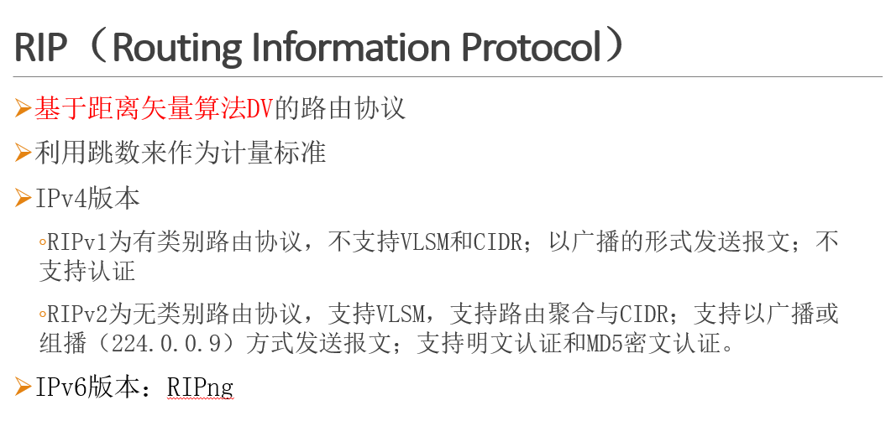
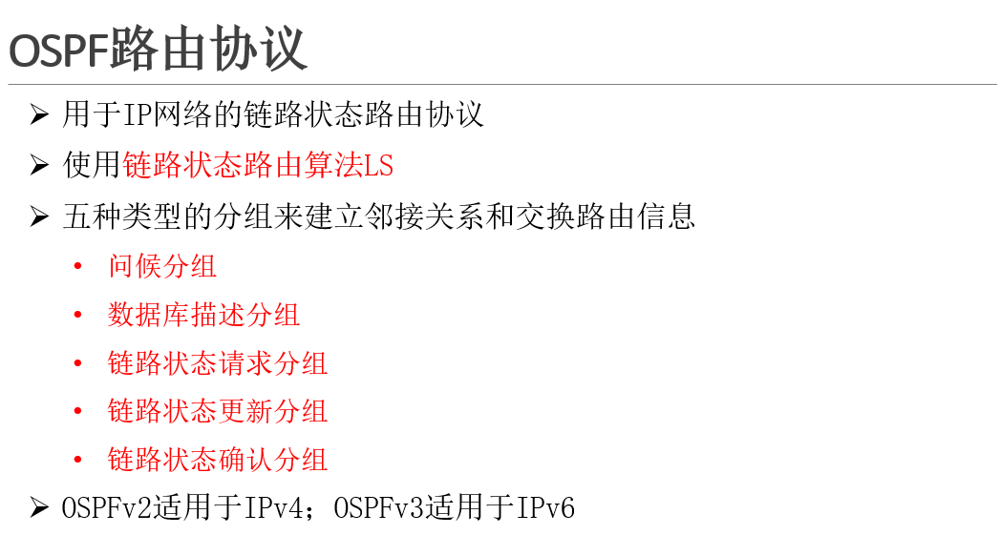
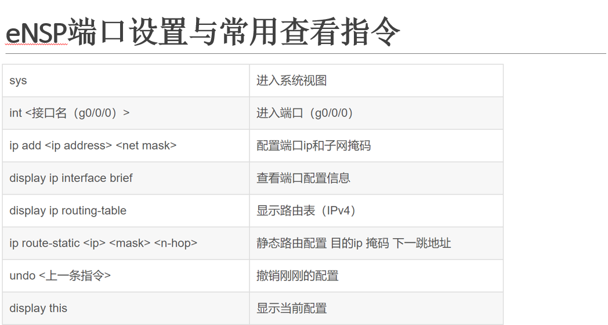
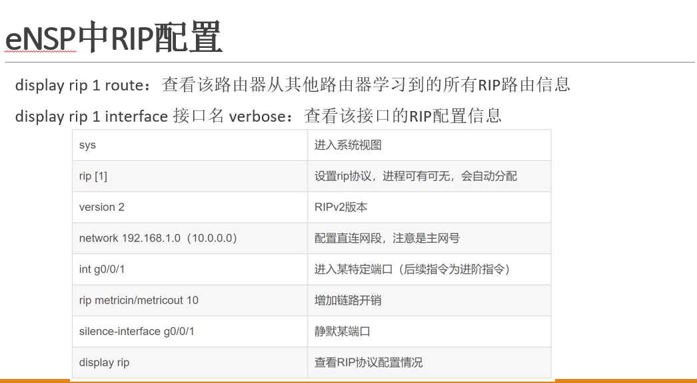
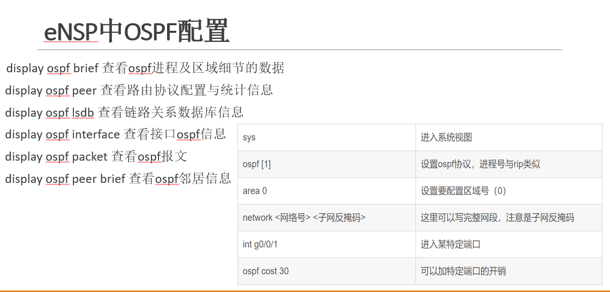
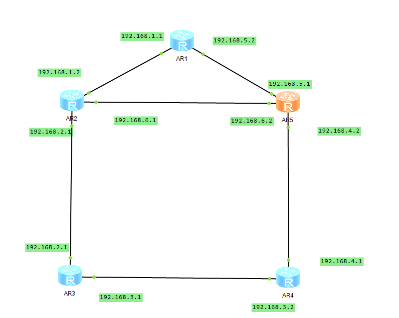
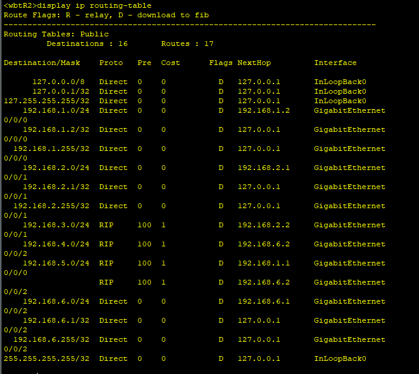

# 
 实验报告 

#### 
姓名：吴伯涛  学号：22920202202831  

### **一、实验目的**

1. 配置指定网络拓扑，分析RIP路由协议收敛具体过程
2. 在任务1基础上断开某段链路，观察并分析各节点路由的变化。
2. 配置指定网络拓扑，分析OSPF路由协议收敛具体过程。

### 二、实验原理

### 三、实验内容/步骤和结果及分析
#### 任务一：配置指定网络拓扑，分析RIP路由协议收敛具体过程
1. 在eNSP中搭建如右图拓扑，配置IP地址，配置RIPv2。观察链路是否连通

按照图片配置路由器

2. 通过Wireshark和各种路由器RIP命令观察路由动态更新，将关键信息分析并截图，完成实验报告
   

### 四、实验小结/感想